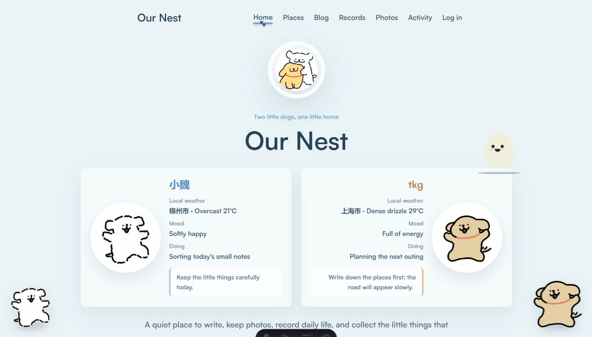
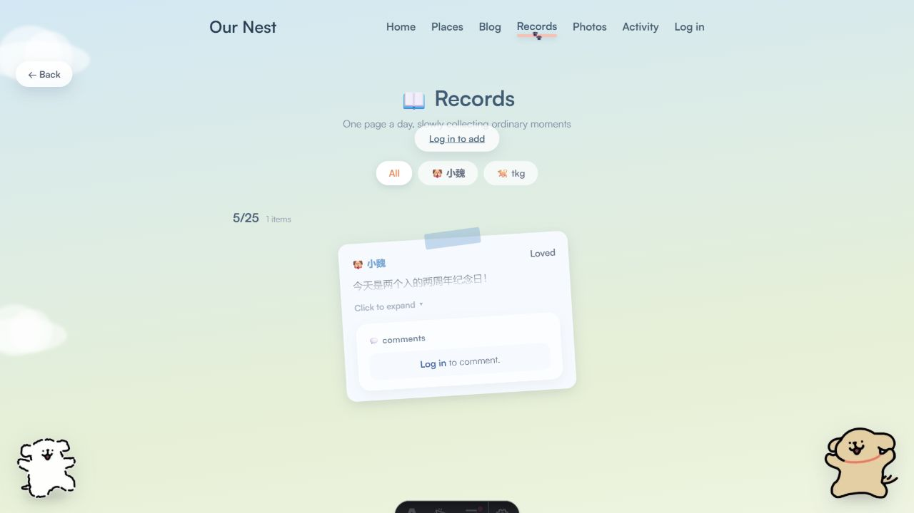
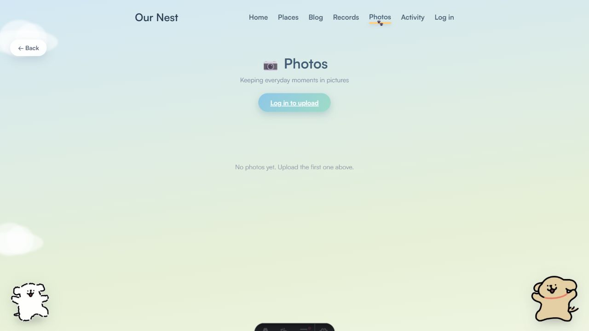
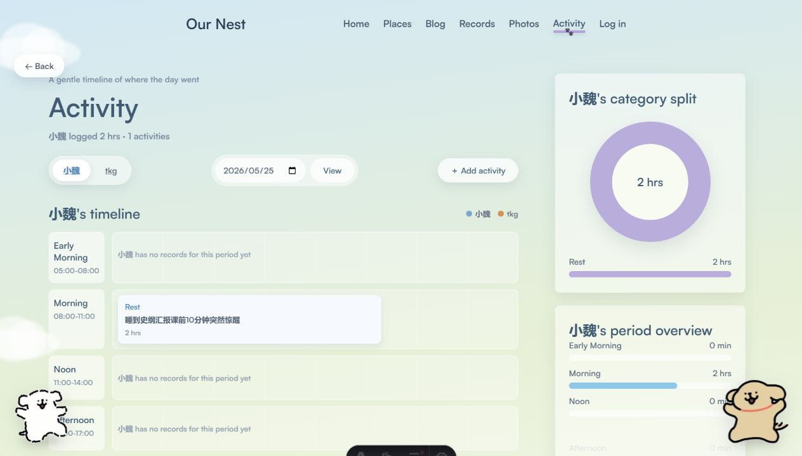

# 我们的小窝 · Our Nest

一个给两个人认真生活、慢慢记录的小网站。

它不是传统意义上的技术博客，也不是冷冰冰的后台系统。「我们的小窝」更像一间柔软的线上房间：可以写文章、存照片、记当天的小事、看一天的时间花到哪里，也可以把今年想去的地方一点点攒起来。



## 项目亮点

- **封闭式双人空间**：只允许白名单内的两个账号登录和访问，全站页面与 API 都按同一私密空间收口，不对第三方开放注册或浏览。
- **双人身份系统**：两位作者分别由白狗和棕狗代表，拥有独立颜色、昵称、状态与内容归属。
- **柔和插画风界面**：云朵背景、玻璃质感导航、角落小狗、漂浮小幽灵，让整个站点像一间可爱的共享小屋。
- **客户端优先加密**：博客正文、记录、评论、Todo、地点文案、状态文案和照片文件都会在浏览器端加密后再上传，服务端与数据库默认只保存密文。
- **内容真实来自 Supabase**：文章、照片、生活记录、活动、地点、评论都走数据库和 Storage，不是静态演示页。
- **Markdown 博客发布**：登录后可以上传 `.md` / `.markdown` 文件，自动解析 frontmatter、标签、摘要和正文。
- **生活记录 + 照片联动**：同一天、同一作者上传的照片会自动出现在对应生活记录里。
- **照片墙与 3D 灯箱**：照片按日期分组，点进详情后可用切片翻转灯箱浏览。
- **一天活动可视化**：用 7 个时间段记录当天活动，自动生成分类占比环形图和时段概览。
- **首页今日状态**：展示双方今日心情、正在做的事和本地天气，让访客一眼看到两个人的当下。
- **评论系统**：博客文章和生活记录都可以留言，适合两个人互相补充和回应。
- **VPS + Supabase 部署**：Astro SSR 以 Node 服务运行，数据和存储托管在 Supabase。

## 页面截图

### 首页

首页是整个小窝的入口：包含双方状态、天气、心情、最近照片、最近文章、想去的地方等信息。Recent Photos 和 Places 只展示真实上传的数据，不再混入默认样例。


### 双人博客

博客页支持文章列表、作者筛选、标签筛选、按年份归档入口，以及登录后的 Markdown 上传。


文章详情页会把 Markdown 按二级标题切成阅读区块，并生成 TOC、阅读进度和评论区。

### 生活记录

生活记录是便签式时间线：按日期分组，记录心情、当天发生的事，并把同一天的照片自动串起来。



### 照片墙

照片墙按拍摄日期聚合照片。上传后会形成照片摞，进入详情后可以网格浏览；灯箱使用 3D 切片翻转效果。



### 今年想去

Places 用来保存今年想去的地方。每个地点有名称、简短愿望和视觉氛围 tone，例如 Starlight、Sunset、Forest、Seaside。


### 时段活动

Activity 用 7 个时间段记录一天：Early Morning、Morning、Noon、Afternoon、Dusk、Evening、Late Night。右侧会自动汇总分类占比和时段使用情况。



### 登录

登录页使用独立的动画角色界面，和主要内容页区分开：更像一个进入小窝前的小门厅。


## 功能总览

| 模块 | 路由 | 功能 |
|---|---|---|
| 首页 | `/` | 欢迎封面、双人状态、天气、最近照片、最近文章、最近地点 |
| 双人博客 | `/blog` | 文章列表、作者筛选、标签筛选、Markdown 上传入口 |
| 博客详情 | `/blog/[slug]` | Markdown 渲染、TOC、阅读进度、评论、删除自己的文章 |
| 生活记录 | `/records` | 按天分组的便签时间线、心情、照片联动、评论 |
| 照片墙 | `/photos` | 按日期分组、照片上传、详情网格、3D 灯箱、删除自己的照片 |
| 时段活动 | `/activity` | 日期切换、作者切换、活动新增、环形图、时段统计 |
| 今年想去 | `/places` | 地点新增、tone 氛围卡片、删除自己的地点 |
| 登录 | `/auth/login` | 仅双账号登录、记住登录、跳转回来源页面 |

## 技术栈

| 层 | 选型 |
|---|---|
| 前端框架 | Astro 6，SSR 模式 |
| 部署适配器 | `@astrojs/node` |
| 数据库 / Auth / Storage | Supabase |
| 包管理 | npm + `package-lock.json` |
| 语言 | Astro、TypeScript、原生浏览器 JS |
| 样式 | 纯 CSS，按页面拆分到 `public/styles` |
| 字体 | Satoshi Variable，本地放在 `public/fonts` |

## 架构简图

```text
浏览器
  ↓ HTTPS
Nginx / Node SSR
  ↓ Astro SSR
Supabase
  ├─ Auth：仅白名单双账号可登录
  ├─ Postgres：profiles / blog_posts / photos / life_records / activity_entries / places / comments / private_space_keys
  └─ Storage：photos / blog-markdown（加密后密文）
```

生产部署默认由 Nginx 反代到本机 Astro Node 服务，数据访问仍由 Supabase 承载。

## 目录结构

```text
astro/
├── public/
│   ├── assets/          # 首页、草地、小狗等图片素材
│   ├── fonts/           # Satoshi 字体
│   ├── gif/             # 小狗待机与动作动图
│   ├── scripts/         # 前端交互脚本
│   └── styles/          # 页面与共享样式
├── src/
│   ├── layouts/         # PrototypeLayout / BaseLayout
│   ├── lib/             # Supabase、auth、private-space、markdown 等工具
│   ├── pages/           # 页面路由和 API endpoints
│   └── middleware.ts    # 全局认证与 locals 注入
├── supabase/
│   └── migrations/      # 数据库迁移 SQL
├── docs/
│   └── screenshots/     # README 截图
├── astro.config.mjs
├── vercel.json
├── package.json
└── README.md
```

## 数据模型

核心表都启用了 RLS，当前设计原则不是“公开可读”，而是“全站私有 + 固定双账号共享同一空间”。

| 表 | 作用 |
|---|---|
| `profiles` | 两位作者资料、身份、昵称、天气、今日心情和正在做的事 |
| `blog_posts` | Markdown 文章元数据、加密正文、标签和作者 |
| `photos` | 照片元数据、拍摄日期、密文文件路径和归属 |
| `life_records` | 每日生活记录、心情、加密正文 |
| `activity_entries` | 某天某时段的活动类型、分钟数、加密描述 |
| `places` | 今年想去的地方、加密地点名、加密备注、氛围 tone |
| `comments` | 博客和生活记录的加密评论 |
| `private_space_keys` | 私密空间密钥包，只保存浏览器生成后的包裹密钥材料 |

说明：

- 业务表统一带 `space_id` 或等效私密空间约束，两位白名单账号共享同一个固定空间。
- 敏感文本字段要求写入客户端密文，数据库约束会拒绝未加密明文。
- 作者信息仍然保留，用于区分是谁创建了内容。

Storage buckets：

| Bucket | 公开 | 用途 |
|---|---|---|
| `photos` | 否 | 存放加密后的照片密文文件 |
| `blog-markdown` | 否 | 存放加密后的 Markdown 备份 |

## 本地开发

### 1. 安装依赖

```bash
npm install
```

### 2. 配置环境变量

复制 `.env.example` 为 `.env`，填入 Supabase 配置：

```text
SUPABASE_URL=https://your-project.supabase.co
SUPABASE_ANON_KEY=...
SUPABASE_SERVICE_ROLE_KEY=...
BACKUP_ENCRYPTION_KEY=...
```

`SUPABASE_SERVICE_ROLE_KEY` 只允许在 Astro 服务端使用，不要写进任何 `PUBLIC_` 环境变量，也不要暴露给浏览器。
新数据使用浏览器端私密空间密钥加密，生产运行环境不需要 `APP_ENCRYPTION_KEY`。

没有 `SUPABASE_URL` 和 `SUPABASE_ANON_KEY` 时，Astro 中间件会直接返回 `500`，本地页面无法正常打开。

### 3. 启动开发服务器

```bash
npm run dev
```

## VPS 自动部署

首次部署在 VPS 上执行：

```bash
export SUPABASE_URL="https://your-project.supabase.co"
export SUPABASE_ANON_KEY="your-anon-key"
export SUPABASE_SERVICE_ROLE_KEY="your-service-role-key"
export DOMAIN="example.com"
sh scripts/vps-deploy.sh
```

常用变量：

```text
APP_NAME=mwblog
APP_DIR=/opt/mwblog
REPO_URL=https://github.com/koajsj/mwblog.git
BRANCH=main
PORT=4321
APP_USER=mwblog
APP_ORIGIN=https://example.com
ENABLE_SSL=1
CERTBOT_EMAIL=admin@example.com
RUN_SETUP_USERS=1
RUN_CLIENT_MIGRATION=0
```

更新部署：

```bash
sh scripts/vps-update.sh
```

部署脚本会安装 Node.js 22、拉取代码、校验 `.env`、按 `package-lock.json` 安装依赖、初始化 `mm/ww` 两个账号、构建 Astro，并以受限的 `APP_USER` systemd 账号运行服务。账号已存在时，初始化脚本只同步固定身份资料，不会重置现有密码；只有显式设置 `RESET_FIXED_USER_PASSWORDS=1` 才会重置。`.env` 会以 `root:APP_USER`、`0640` 保存，仅供应用与备份服务读取。`APP_ORIGIN` 用于信任 Nginx 转发的 HTTPS 协议并保证 CSRF 同源校验正常；部署或更新脚本会按域名自动补齐。设置 `ENABLE_SSL=1` 时必须提供域名，Certbot 或证书签发失败会中止部署并禁用该站点的 Nginx 配置，避免 HTTP 降级。Nginx 上传体积限制为 60MB，应用照片上传限制为 50MB。

更新脚本会先完成拉取、依赖安装和构建，成功后才重启 systemd 服务。构建或重启失败时会尝试回到更新前的提交并重新构建启动；数据迁移始终需要单独确认，数据库和 Storage 变更不会自动回滚。客户端加密迁移需要解锁私密空间密钥，默认不会自动执行，可在准备好 `SPACE_PASSPHRASE` 或 `SPACE_RECOVERY_CODE` 后设置 `RUN_CLIENT_MIGRATION=1` 或手动运行 `npm run migrate:client-encryption`。如果历史数据仍处于 `enc:v1` / `MWBLOG_FILE_V1`，只在一次性离线迁移时临时提供 `APP_ENCRYPTION_KEY` 并设置 `ALLOW_LEGACY_SERVER_DECRYPTION=1`。

默认访问：

```text
http://localhost:4321
```

### 4. 生产构建检查

```bash
npm run build
```

推送前建议至少跑一次 build，避免 Vercel 部署时才发现模板或类型错误。

## Supabase 初始化

在 Supabase SQL Editor 中按顺序运行 `supabase/migrations/` 下的全部 SQL 文件：

```text
001_initial_schema.sql
...
019_enforce_client_ciphertext.sql
020_lock_private_space_identities.sql
```

其中：

- `017_private_space_closure.sql` 负责关闭公开注册、固定双账号白名单和私密空间约束。
- `018_client_private_space_keys.sql` 负责存放浏览器端生成的私密空间密钥包。
- `019_enforce_client_ciphertext.sql` 负责强制敏感字段只能写入客户端密文。
- `020_lock_private_space_identities.sql` 锁定 profile 身份字段，并禁止覆盖已创建的私密空间密钥包。

以后如果新增表或字段，请继续在 `supabase/migrations/` 下增加新的 SQL 文件，并按顺序执行。

## 双人账号规则

网站不提供注册入口。固定账号为：

```text
mm  -> mm@our-nest.local
ww  -> ww@our-nest.local
```

配置好 `.env` 后运行一次：

```bash
npm run setup:users
```

脚本会在 Supabase Auth 中创建或更新这两个账号，并同步 `profiles` 表中的 `author_key`。

默认初始化密码当前为：

```text
mm / qwerasdf
ww / qwerasdf
```

这是引导用默认值。首次部署后应立即在 Supabase Auth 中改成你们自己的密码。再次运行 `npm run setup:users` 只会同步固定身份资料；只有显式设置 `RESET_FIXED_USER_PASSWORDS=1` 才会重置密码。

## 客户端加密

敏感数据会在浏览器端完成加密后再离开用户设备：

- 文本内容使用 Web Crypto API 做 AES-256-GCM 加密。
- 私密空间密钥由浏览器生成，服务端只保存包裹后的 key bundle，不保存明文解密密钥。
- 照片会先在浏览器端加密，再上传到 Storage；即使拿到 Storage 对象地址，也无法直接看到原图。

迁移旧数据时使用：

```bash
npm run migrate:client-encryption
```

运行前需要满足两件事：

- 数据库已执行到 `018_client_private_space_keys.sql`
- 先在浏览器里登录一次并完成私密空间解锁，让 `private_space_keys` 中存在可用 key bundle

## 上传与管理

登录后可以：

- 在 `/blog` 上传 Markdown 文章。
- 在 `/photos` 上传照片。
- 在 `/records` 写生活记录，并可附带多张照片。
- 在 `/activity` 给当天某个时段添加活动。
- 在 `/places` 添加想去的地方。

删除操作只允许删除自己的内容。前端会显示确认弹窗，后端也会根据 `locals.user`、白名单身份和记录归属校验。

## Markdown 支持

项目内置了轻量 Markdown 渲染器，支持：

- frontmatter：`title`、`excerpt`、`tags`
- 标题：`#`、`##`、`###` 等
- 段落、列表、引用、分割线
- 表格、任务列表
- 代码块和行内代码
- 粗体、斜体、删除线
- 链接和图片

文章详情页会按 `##` 二级标题切分为 `article-section`，用于生成 TOC 和滚动高亮。

## 部署

项目当前推荐使用 VPS 部署。首次部署使用 `scripts/vps-deploy.sh`，后续更新使用 `scripts/vps-update.sh`。脚本会安装 Node.js、拉取 GitHub 代码、校验 `.env`、构建 Astro、安装 systemd 服务、配置 Nginx，并创建每日加密备份任务。

常用提交流程：

```bash
npm run build
git add .
git commit -m "更新小窝"
git push origin main
sudo /opt/mwblog/scripts/vps-update.sh
```

## 注意事项

- 本地 `.env` 如果指向生产 Supabase，那么本地新增/删除的数据也会影响线上数据。
- `.env` 已在 `.gitignore` 中，绝对不要提交真实密钥。
- 这个项目不是公开站点，任何第三方账号即使存在于 Supabase，也不应被加入白名单。
- 数据库和 Storage 默认保存的是密文，不代表可以忽略前端设备安全；浏览器已登录且已解锁时，明文仍会在客户端内存中短暂存在。
- 登录页是独立 HTML，不走主 layout，这是为了保留动画角色登录页的完整视觉。

## 后续可以继续做的事

- RSS / sitemap。
- 博客全文搜索。
- 按年/月归档。
- 照片缩略图与压缩。
- 独立 dev Supabase 环境，避免本地开发影响生产数据。
- 更完整的移动端横屏适配。

## 一句话

「我们的小窝」想做的不是一个功能堆满的站点，而是一个两个人愿意一直打开、一直记录的小地方。
